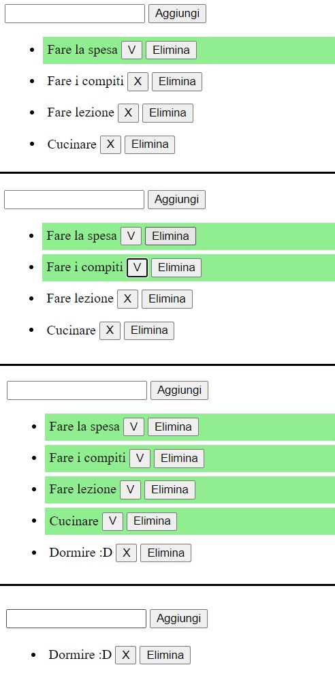

# VueJS-to-do-list
Simple to do list using VueJS.    
It is possible to add a task by either clicking the button or pressing enter.   
When a new task is added, by default, it is not completed and by clicking X it is possible to mark it done.   
The user can also delete a task.

HTML, CSS, VueJS.

***
### [Live Website](https://gianluigivitale.github.io/vuejs-to-do-list/)
***
### Preview:

